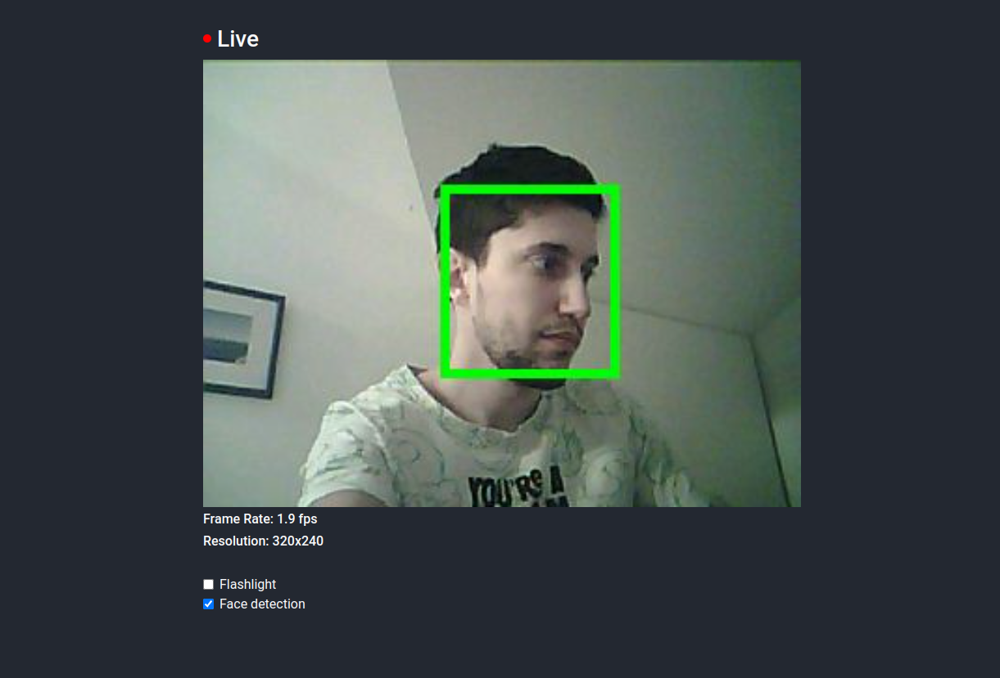

# ESP32 Face Detection
A web server on the ESP32 microcontroller providing live camera streaming with real-time face detection.


## Setup
``` bash
git submodule update --init --recursive
cd components/esp-dl && git apply ../../esp-dl.patch
# Flash SD card to FAT and create file called wifi.txt, and put WiFi credentials inside. # First row network SSID, second row network password.
```

## Build only
``` bash
idf.py build
```

## Flash with building
``` bash
idf.py flash -b 115200
```

## Monitor run
``` bash
idf.py monitor
```
